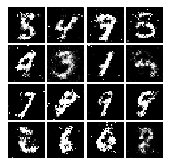
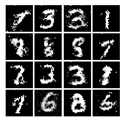
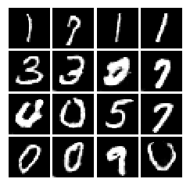
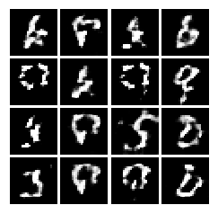
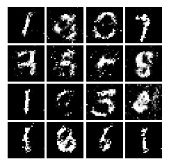
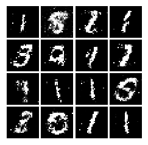
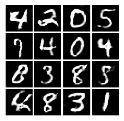

# GANs
This repository is a comparitive study of [Vanilla GAN](https://arxiv.org/abs/1406.2661), [LSGAN](https://arxiv.org/abs/1611.04076), [DCGAN](https://arxiv.org/abs/1511.06434), and [WGAN](https://arxiv.org/abs/1704.00028) for MNIST dataset on both tensorflow and pytorch frameworks.

## What is this GAN thing?

In 2014, [Goodfellow et al.](https://arxiv.org/abs/1406.2661) presented a method for training generative models called Generative Adversarial Networks (GANs for short). In a GAN, there are two different neural networks. Our first network is a traditional classification network, called the **discriminator**. We will train the discriminator to take images, and classify them as being real (belonging to the training set) or fake (not present in the training set). Our other network, called the **generator**, will take random noise as input and transform it using a neural network to produce images. The goal of the generator is to fool the discriminator into thinking the images it produced are real.


Since 2014, GANs have exploded into a huge research area, with massive [workshops](https://sites.google.com/site/nips2016adversarial/), and [hundreds of new papers](https://github.com/hindupuravinash/the-gan-zoo). Compared to other approaches for generative models, they often produce the highest quality samples but are some of the most difficult and finicky models to train (see [this github repo](https://github.com/soumith/ganhacks) that contains a set of 17 hacks that are useful for getting models working). Improving the stabiilty and robustness of GAN training is an open research question, with new papers coming out every day! For a more recent tutorial on GANs, see [here](https://arxiv.org/abs/1701.00160). There is also some even more recent exciting work that changes the objective function to Wasserstein distance and yields much more stable results across model architectures: [WGAN](https://arxiv.org/abs/1701.07875), [WGAN-GP](https://arxiv.org/abs/1704.00028).

GANs are not the only way to train a generative model! For other approaches to generative modeling check out the [deep generative model chapter](http://www.deeplearningbook.org/contents/generative_models.html) of the Deep Learning [book](http://www.deeplearningbook.org). Another popular way of training neural networks as generative models is Variational Autoencoders (co-discovered [here](https://arxiv.org/abs/1312.6114) and [here](https://arxiv.org/abs/1401.4082)). Variational autoencoders combine neural networks with variational inference to train deep generative models. These models tend to be far more stable and easier to train but currently don't produce samples that are as pretty as GANs.

## Model Architecture


Both Generator and Discriminator are stacked fully-connected layers in case of **Vanilla GAN** and Convolutional in case of **DCGAN**

## Loss Function

### Vanilla GAN

This loss function is from the original paper by [Goodfellow et al.](https://arxiv.org/abs/1406.2661). It can be thought as minimax game between generator and discriminator where generator (<a href="https://www.codecogs.com/eqnedit.php?latex=$G$" target="_blank"></a>) trying to fool the discriminator (<a href="https://www.codecogs.com/eqnedit.php?latex=$D$" target="_blank"></a>), and the discriminator trying to correctly classify real vs. fake.

<a href="https://www.codecogs.com/eqnedit.php?latex=$$\underset{G}{\text{minimize}}\;&space;\underset{D}{\text{maximize}}\;&space;\mathbb{E}_{x&space;\sim&space;p_\text{data}}\left[\log&space;D(x)\right]&space;&plus;&space;\mathbb{E}_{z&space;\sim&space;p(z)}\left[\log&space;\left(1-D(G(z))\right)\right]$$" target="_blank"></a>

where <a href="https://www.codecogs.com/eqnedit.php?latex=$x&space;\sim&space;p_\text{data}$" target="_blank"></a> are samples from the input data, <a href="https://www.codecogs.com/eqnedit.php?latex=$z&space;\sim&space;p(z)$" target="_blank"></a> are the random noise samples, <a href="https://www.codecogs.com/eqnedit.php?latex=$G(z)$" target="_blank"></a> are the generated images using the neural network generator <a href="https://www.codecogs.com/eqnedit.php?latex=$G$" target="_blank"></a>, and <a href="https://www.codecogs.com/eqnedit.php?latex=$D$" target="_blank"></a> is the output of the discriminator, specifying the probability of an input being real. In [Goodfellow et al.](https://arxiv.org/abs/1406.2661), they analyze this minimax game and show how it relates to minimizing the Jensen-Shannon divergence between the training data distribution and the generated samples from $G$.

To optimize this minimax game, we will aternate between taking gradient *descent* steps on the objective for <a href="https://www.codecogs.com/eqnedit.php?latex=$G$" target="_blank"></a>, and gradient *ascent* steps on the objective for <a href="https://www.codecogs.com/eqnedit.php?latex=$D$" target="_blank"></a>:
1. update the **generator** (<a href="https://www.codecogs.com/eqnedit.php?latex=$G$" target="_blank"></a>) to minimize the probability of the __discriminator making the correct choice__. 
2. update the **discriminator** (<a href="https://www.codecogs.com/eqnedit.php?latex=$D$" target="_blank"></a>) to maximize the probability of the __discriminator making the correct choice__.

While these updates are useful for analysis, they do not perform well in practice. Instead, we will use a different objective when we update the generator: maximize the probability of the **discriminator making the incorrect choice**. This small change helps to allevaiate problems with the generator gradient vanishing when the discriminator is confident. This is the standard update used in most GAN papers, and was used in the original paper from [Goodfellow et al.](https://arxiv.org/abs/1406.2661). 

Here, We will alternate the following updates:
1. Update the generator (<a href="https://www.codecogs.com/eqnedit.php?latex=$G$" target="_blank"></a>) to maximize the probability of the discriminator making the incorrect choice on generated data:

<a href="https://www.codecogs.com/eqnedit.php?latex=$$\underset{G}{\text{maximize}}\;&space;\mathbb{E}_{z&space;\sim&space;p(z)}\left[\log&space;D(G(z))\right]$$" target="_blank"></a>

2. Update the discriminator (<a href="https://www.codecogs.com/eqnedit.php?latex=$D$" target="_blank"></a>), to maximize the probability of the discriminator making the correct choice on real and generated data:

<a href="https://www.codecogs.com/eqnedit.php?latex=$$\underset{D}{\text{maximize}}\;&space;\mathbb{E}_{x&space;\sim&space;p_\text{data}}\left[\log&space;D(x)\right]&space;&plus;&space;\mathbb{E}_{z&space;\sim&space;p(z)}\left[\log&space;\left(1-D(G(z))\right)\right]$$" target="_blank"></a>

### LSGAN

It is more stable alternative to the original GAN loss function.

#### Generator Loss

<a href="https://www.codecogs.com/eqnedit.php?latex=$$\ell_G&space;=&space;\frac{1}{2}\mathbb{E}_{z&space;\sim&space;p(z)}\left[\left(D(G(z))-1\right)^2\right]$$" target="_blank"></a>

#### Discriminator Loss

<a href="https://www.codecogs.com/eqnedit.php?latex=$$&space;\ell_D&space;=&space;\frac{1}{2}\mathbb{E}_{x&space;\sim&space;p_\text{data}}\left[\left(D(x)-1\right)^2\right]&space;&plus;&space;\frac{1}{2}\mathbb{E}_{z&space;\sim&space;p(z)}\left[&space;\left(D(G(z))\right)^2\right]$$" target="_blank"></a>

### WGAN

Algorithm from [WGAN](https://arxiv.org/abs/1704.00028) paper.


## Dependencies

A system with `anaconda` and `jupyter notebook` installed is required.

### Python Packages required

`PyTorch 0.3`

`TensorFlow r1.7`

`numpy 1.4.2`

`matplotlib`

## How to run?
Change to any directory you want to download the project to.

```shell
git clone https://github.com/divyanshj16/GANs.git
cd GANs
jupyter notebook
```

## System Requirements

Since the dataset is small this can run even on CPU in reasonable time. The GPU provides big boost to the DCGAN part.

## Results

### TensorFlow

#### Vanilla GANs



#### LSGAN loss + Vanilla Architechture



#### DCGAN with LSGAN loss



#### WGAN



### PyTorch

#### Vanilla GANs



#### LSGAN loss + Vanilla Architechture



#### DCGAN with LSGAN loss


